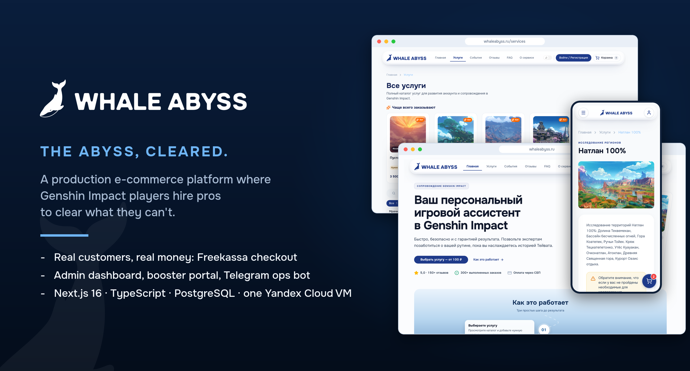
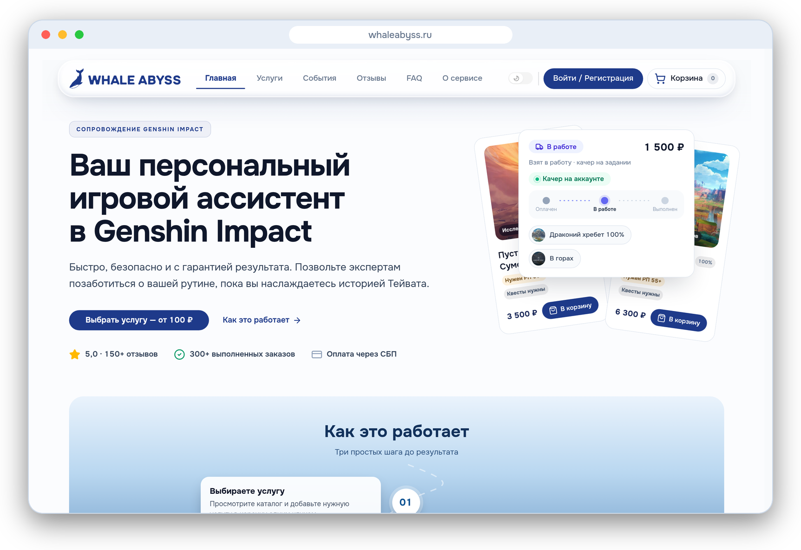
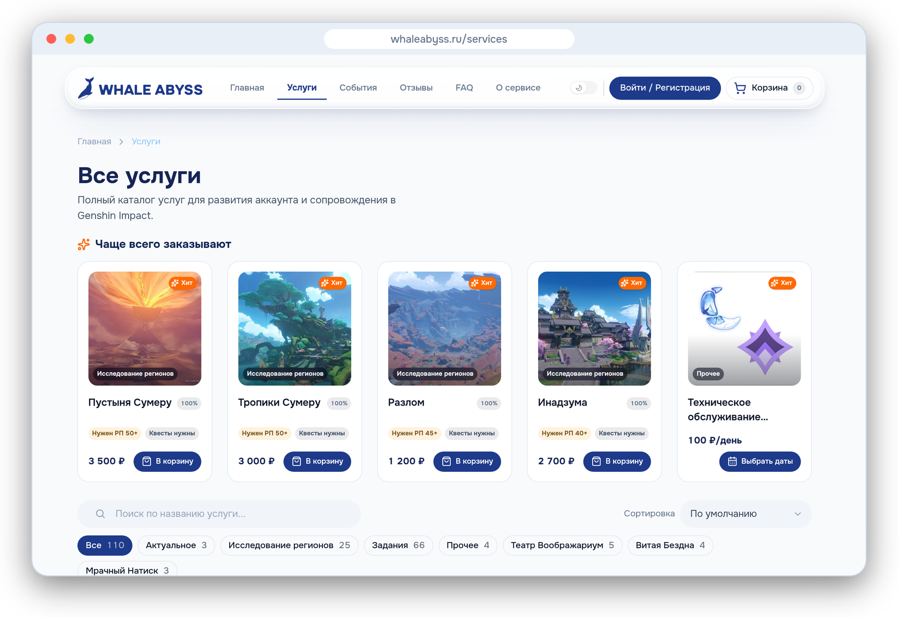
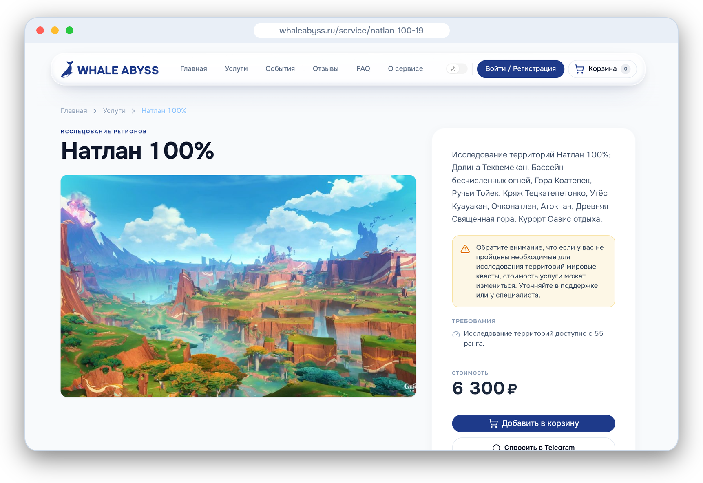
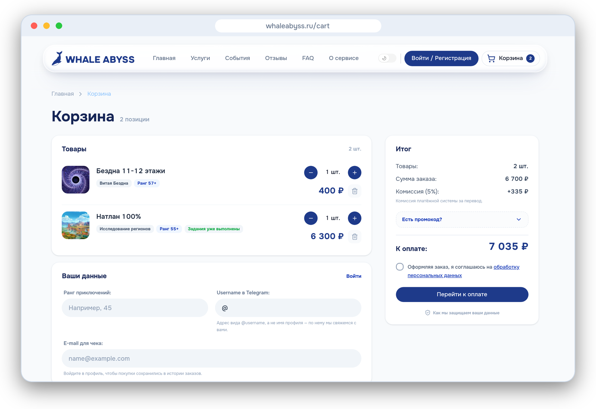
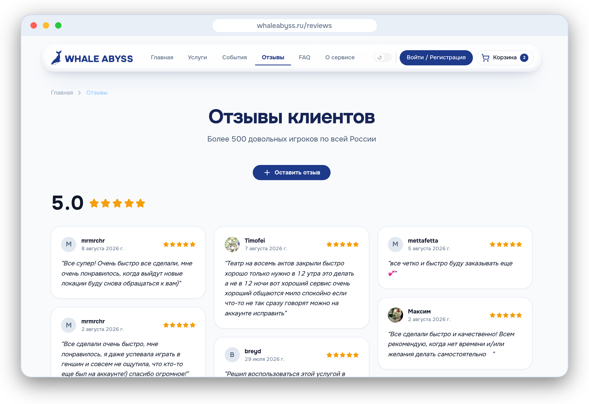
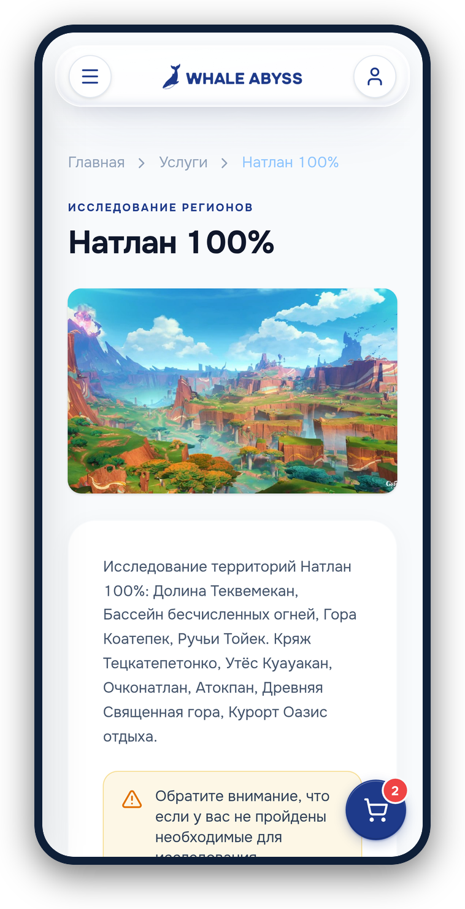

  

   
  
  
  
  

 

  <h3>Most portfolio projects simulate a business. This one runs one.</h3>
  
<b>Whale Abyss</b> is a live storefront for Genshin Impact boosting: players pay
  real money, boosters clear the content, an admin panel splits the revenue, and a
  Telegram bot reports every order. 100+ paid orders, 230+ registered users,
  one developer, one small VM.

 

---

## A storefront that sells while you scroll

The first screen answers the three questions a buyer actually has: what is this,
can I trust it, and what does it cost. The hero card on the right is not a static
picture: it cycles through a real order's life (paid → in progress → done, with the
«booster on the account» badge) so a visitor sees what buying feels like before
spending a ruble. Under the fold: the three-step explainer, the catalogue, reviews.

## 108 services, curated like a shop window

Region exploration, world quest chains, Spiral Abyss floors, event clears and
per-day subscriptions, in admin-ordered sections with a «Хит» rail on top.
Search and category filters run server-side; the admin reorders sections and
spotlights a service into «Актуальное» without redeploying anything.

## A product page that knows the game

Every service carries its real constraints: the Adventure Rank it requires, the
world quests that gate the region, the exact zones included in a 100% clear.
Exploration services open a quest-addon dialog on add-to-cart, and the customer's
choice («already done», «I'll do them myself», or buying the quests as lines)
travels with the order all the way to the booster's Telegram notification.

## A cart that refuses to lie

The client's numbers are decoration. `POST /api/checkout` recomputes every line
price and the total from the database, validates promocodes against the buyer,
and rejects with a 409 any quest-gated service that arrives without its
declaration, so a lost modal can never become an ambiguous paid order. Guest
carts survive signing in (merged, not overwritten), and cart syncs are
serialised so two racing requests can't resurrect deleted items.

## Proof, not promises

167 reviews with a 5.0 average, migrated verbatim from the shop's Telegram
channel and joined by on-site ones since. Buyers leave theirs after checkout;
everything is moderated in the admin panel.

<table>
<tr>
<td width="34%"></td>
<td valign="top">

### Built for the phone it will be read on

Most customers arrive from Telegram and VK on a phone, so every page is designed
mobile-first: the drawer navigation, the floating cart button with a live count,
tap-sized controls everywhere. The desktop version is the adaptation, not the
other way around.

The whole UI speaks one design language: a single family of form controls, one
button system, one card radius, defined once in a global stylesheet instead of
per-page classes. That is why a redesign here is an edit, not a hunt.

</td>
</tr>
</table>

---

## The half a screenshot can't show

The public site is maybe a third of the codebase. Behind `/admin` and `/portal`
(role-gated at the edge and re-checked server-side) the actual business runs:

- **A profit dashboard** that names its formula: revenue minus booster
  commissions, per week or month, with deltas that always name their baseline.
- **A booster roster with a 40/60 split.** Completing an order credits the
  booster's balance exactly once, computed from pre-discount line prices so a
  customer's promocode never shrinks the booster's cut.
- **A booster portal** where качеры see their assigned orders, flip them to
  completed, and toggle «я на аккаунте», which the customer sees live.
- **A Telegram bot** that notifies the admin chat about every paid order with
  full context, behind a secret-token-verified webhook.
- **Test orders and manual orders**, flagged in the schema and excluded from
  every money query, so the admin can rehearse flows or record an off-site sale
  without corrupting revenue.
- **Order lifecycle cleanup**: abandoned checkouts auto-cancel after an hour,
  are deleted after Freekassa's 24h retry window closes, and a late webhook can
  still legitimately re-open and fulfill a cancelled order.

## Built like it matters

| | |
|---|---|
| **Runtime** | Next.js 16 (App Router) · React Server Components · TypeScript strict · 45 pages · 63 API routes |
| **Data** | PostgreSQL · Drizzle ORM · 18 tables · server-side pagination and filtering in SQL |
| **Auth** | NextAuth credentials + Yandex ID OAuth · email OTP with SmartCaptcha · roles: user, booster, admin |
| **Payments** | Freekassa SCI with signature-verified webhooks · СБП · server-side price recomputation |
| **Security** | CSP + security headers · per-user rate limiting on every costly route · constant-time webhook auth |
| **Ops** | GitHub Actions deploy gated on `tsc` · out-of-place build with health-checked atomic swap and rollback · pm2 + nginx on one Yandex Cloud VM |
| **Images** | Yandex Cloud S3 · content-hashed immutable URLs · a year of browser cache with zero staleness |

## A few decisions worth naming

- **The server holds every invariant.** Client-side gates (the quest modal, the
  cart) are UX affordances; checkout re-derives prices, discounts and addon
  declarations from the database and rejects what does not hold. This rule was
  paid for: a silent client-side fallback once produced a paid order nobody
  could interpret, and the 409 backstop is what ended that class of bug.
- **A failed deploy is a no-op, not an outage.** The build lands in a separate
  directory, is verified, then swapped in atomically; the health check hits a
  prerendered route (the one that actually breaks) and rolls back on failure.
- **The session token is a cache, never a source of truth.** Role, name and
  avatar are re-read from the database on every request, so a stale 30-day JWT
  can't show yesterday's identity.
- **Rate limits key on user id, not IP.** Half of Russian mobile traffic shares
  carrier NAT, and X-Forwarded-For is client-controlled; identity is the only
  honest key. IP buckets remain as a backstop for anonymous calls.
- **Degradations on the money path are loud.** If the addons list can't load,
  the add is refused with a retry, never silently downgraded, and the Telegram
  notification flags any order whose shape looks wrong.

---

  Built by <a href="https://github.com/adilzhanY">Adilzhan</a> · live at
  <a href="https://whaleabyss.ru">whaleabyss.ru</a> · every screenshot is the
  production site, staged with its own real catalogue data ·
  refresh them with <code>scripts/readme/snap.mjs</code> + <code>build-shots.py</code>
  (see <a href="docs/shots/HOW.md">docs/shots/HOW.md</a>)

